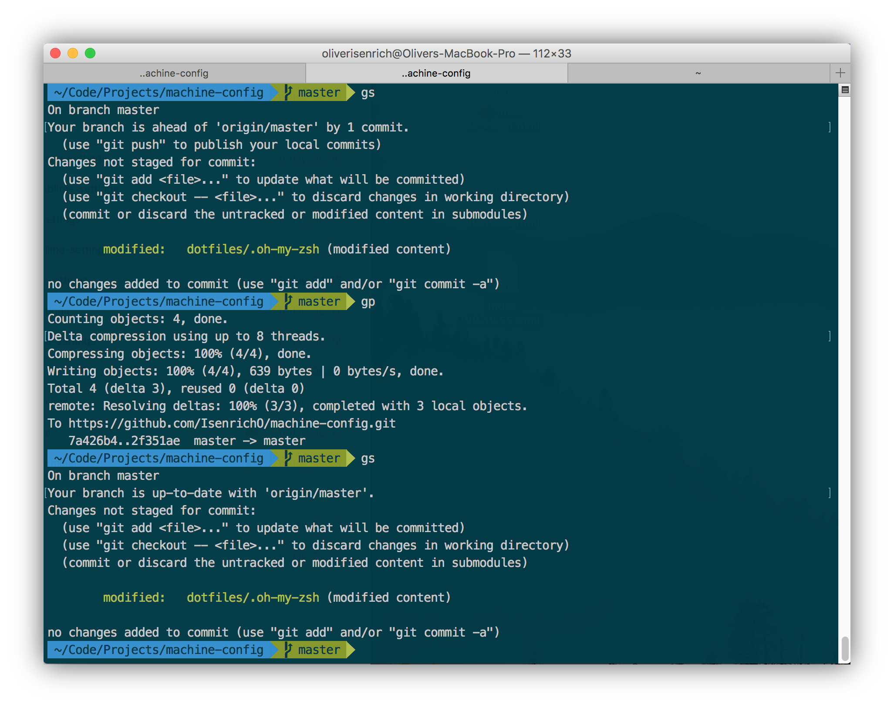

# Machine Configuration

[machine-config](https://github.com/IsenrichO/machine-config) is a collection of static assets, configuration files (_.*rc_) and settings/user preference resources that I use to get a new machine back up and running with the dev environment I want and the time wasted I don't. It ensures I have a persisted home for some of the most important "meta-files" used to make my Mac... my Mac. In particular, it sets me back up with my preferred Sublime editor and Terminal environments without the massive workflow interruptions that often accompany getting started on a new machine.

---

## Contents

This repository is divided into several sub-directories, the contents of which have been grouped together by virtue of the functions they serve or categorization under which they fall.

|  Directory   | Description                               |
| :----------: | :---------------------------------------- |
|  **assets**  | Miscellaneous static files (_e.g._, graphics, logs, _etc_.) for reference use internal to this project. |
| **dotfiles** | A collection of system/application setting files (of the type that begin with a… dot, and are usually not outwardly visible to you from Mac's Finder). |
| **settings** | Application settings files that preserve a memory of my desired setup and other user preferences. |
|  **shell**   | A collection of assets pertinent to my Terminal and the way I like it configured. |

---

## Sublime Text

I've spent embarassingly much time messing with Sublime's user settings file [Ref. _User/Preferences.sublime-settings_], but have finally got something I think I can tolerate for a while. Before just transposing this settings object to another Sublime dist, remember that a bevy of packages and plugins must first be installed for many of those settings fields to have recongizeable effects. Alphabetically, we have:
  + [**AdvancedNewFile:**](https://github.com/skuroda/Sublime-AdvancedNewFile) Allows for faster creation of new files
  + [**Agila Theme:**](https://github.com/arvi/Agila-Theme) Agila theme source
  + [**AutoFileName:**](https://github.com/BoundInCode/AutoFileName) Equips Sublime with file name autocompletion functionality
  + [**Autoprefixer:**](https://github.com/sindresorhus/sublime-autoprefixer) Embeds automatic vendor prefixing support to CSS files in Sublime
  + [**Babel:**](https://github.com/babel/babel-sublime) Syntax lexicon for ES2015 JavaScript with expanded coverage for React's expressive JSX syntax
  + [**Better CoffeeScript:**](https://github.com/aponxi/sublime-better-coffeescript) Presents a side-by-side view of real-time compiled CoffeeScript output
  + [**BracketHighlighter:**](https://github.com/facelessuser/BracketHighlighter) Bracket matching plugin
  + [**ColorPicker:**](https://github.com/weslly/ColorPicker) Multi-platform color picker plugin
  + [**Console Wrap for js:**](https://github.com/unknownuser88/consolewrap) Wraps selected variable in a `console.log()` statement (`⌃ + ⇧ + q`)
  + [**EditorConfig:**](https://github.com/sindresorhus/editorconfig-sublime) Helps maintain code style consistency across different IDEs
  + [**Emmet:**](https://github.com/sergeche/emmet-sublime) Plugin that supports abbreviated code generation
  + [**Entheogen Color Scheme:**](https://github.com/tomaash/entheogen) Entheogen color scheme source
  + [**Git:**](https://github.com/kemayo/sublime-text-git) Minimalist Git integration wizard for Sublime
  + [**GitGutter:**](https://github.com/jisaacks/GitGutter) Adds informative gutter icons indicating version control changes [PC](https://packagecontrol.io/packages/GitGutter)
  + [**GitHub Flavored Markdown Preview:**](https://github.com/dotcypress/GitHubMarkdownPreview) Enables live previews of MarkDown (_*.md_) files as would be interpreted by a GitHub-flavored MD engine
  + [**HTML5:**](https://github.com/mrmartineau/HTML5) Adds HTML5 syntax recognition and support for relevant snippets
  + [**HTMLAttributes:**](https://github.com/agibsonsw/HTMLAttributes) HTML attribute completion plugin for Sublime Text
  + [**Javascript Beautify:**](https://github.com/enginespot/js-beautify-sublime) JavaScript language style enhancer plugin
  + [**jQuery:**](https://github.com/SublimeText/jQuery) Syntax highlighter and snippet support for jQuery
  + [**JsFormat:**](https://github.com/jdc0589/JsFormat) A JavaScript/JSON formatting plugin built off JSBeautifier
  + [**Material Theme:**](https://github.com/equinusocio/material-theme) Material theme source
  + [**Material Theme - Appbar:**](https://github.com/equinusocio/material-theme-appbar) Enables a tinted app bar compatible with a pre-existing Material theme installation
  + [**Material Theme - White Panels:**](https://github.com/equinusocio/material-theme-white-panels) Enables white-colored panels inside an existing Material theme installation
  + [**Materialize:**](https://github.com/saadq/Materialize) Extends the Material theme to some of Sublime Text's most popular color schemes
  + [**Nodejs:**](https://github.com/tanepiper/SublimeText-Nodejs) Adds Node.js snippets and bindings to the Sublime IDE
  + [**Package Control:**](https://github.com/wbond/package_control) The full-featured interface used to install these very packages [PC](https://packagecontrol.io/)
  + [**ReactJS:**](https://github.com/facebookarchive/sublime-react) Sublime Text helpers for ReactJS
  + [**Sass:**](https://github.com/nathos/sass-textmate-bundle) Adds syntax highlighting support for Sass stylesheet language
  + [**SideBarEnhancements:**](https://github.com/SideBarEnhancements-org/SideBarEnhancements) Adds all the actions (_e.g._, Rename, Delete, Refresh, Move, _etc_.) in to the context menu that should've been native.
  + [**SublimeLinter:**](https://github.com/SublimeLinter/SublimeLinter3) Interactive Sublime linter
  + [**SublimeLinter-contrib-eslint:**](https://github.com/roadhump/SublimeLinter-eslints) An ESLint-compatible interface for extensible SublimeLinter use
  + [**SublimeREPL:**](https://github.com/wuub/SublimeREPL) Provides an in-house Sublime interpreter (REPL)
  + [**Syntax Highlighting for Sass:**](https://github.com/P233/Syntax-highlighting-for-Sass) Syntax lexicon for Sass-style preprocessed CSS
  + [**Theme - Flatland:**](https://github.com/thinkpixellab/flatland) Flatland theme source
  + [**Theme - Kronuz:**](https://github.com/Kronuz/Kronuz-Theme) Kronuz theme source
  + [**Theme - Toxin:**](https://github.com/p3lim/sublime-toxin) Toxin theme source
  + [**zz File Icons:**](https://github.com/ihodev/sublime-file-icons) Expands the dictionary of file types for which there are supported format-specific icons in the file sidebar

---

## Shell

My Terminal profile is derived from [Agnoster](https://github.com/agnoster/agnoster-zsh-theme)'s awesome theme built for the Zsh shell.

---

## Shoutouts

Like what you see? Go ahead and fork this repo and customize it to suit your particular needs; or just download the _*.zip_ and go on with ya bad self! Be sure to substitute user-specific field values (_e.g._, **user.name** and **user.email** in the _.gitconfig_) with your own profile information though.
