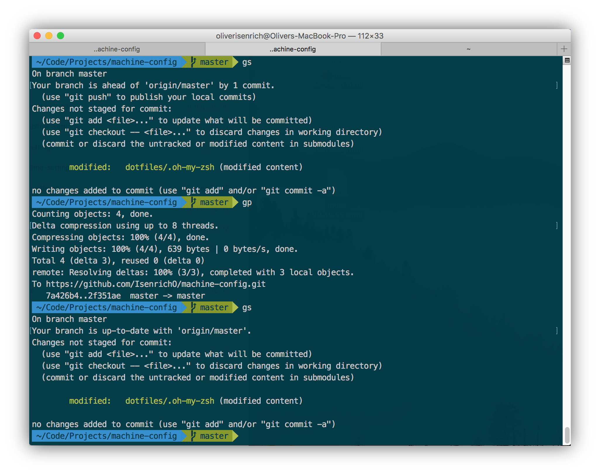

# Machine Configuration

[machine-config](https://github.com/IsenrichO/machine-config) is a collection of static assets, configuration (_.*rc_) files and settings/user preference resources that I use to get a new machine back up and running with the dev environment I want and the time wasted I don't.

---

## Contents

This repository is divided into several sub-directories, the contents of which have been grouped together by virtue of the functions they serve or categorization under which they fall.

|  Directory   | Description                               |
| :----------: | :---------------------------------------- |
|  **assets**  | Miscellaneous static files (_e.g._, graphics, logs, _etc_.) for reference use internal to this project. |
| **dotfiles** | A collection of system/application setting files (of the type that begin with a… dot, and are usually not outwardly visible to you from Mac's Finder). |
| **settings** | Application settings files that preserve a memory of my desired setup and other user preferences. |
|  **shell**   | A collection of assets pertinent to my Terminal and the way I like it configured. |

---

## Sublime Text

---

## Shell

---

## Shoutouts

Like what you see? Go ahead and fork this repo and customize it to suit your particular needs; or just download the *.zip and go on with ya bad self! Be sure to substitute user-specific field values (_e.g._, **user.name** and **user.email** in the _.gitconfig_) with your own profile information though.
